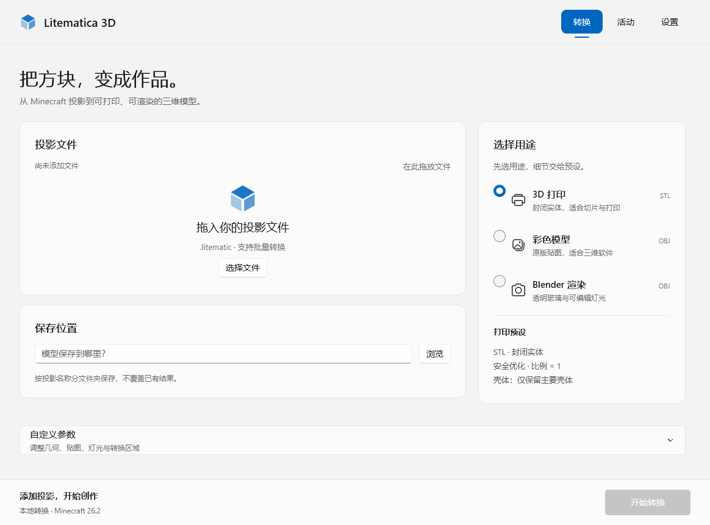

# Litematica 3D — WinUI 3 前端

界面采用顶部导航和双栏转换工作台：文件与保存位置在左侧，用途选择在右侧。
高级参数分组折叠，仅显示当前用途适用的设置。窄窗口自动改为纵向布局。
活动页提供结果卡片、实时日志与 JSON 报告；底部转换按钮和进度始终可见。



本地 Windows 桌面界面使用 C# / XAML 和 WinUI 3，直接调用既有 Python 转换引擎。
无需 Qt、WebView 或本地 HTTP 服务。旧 PySide6 界面与 CLI 保留，便于对照和兼容原有工作流。

## 启动

开发环境：Windows 10 2004 或更高版本、x64、.NET 10 SDK、Python 3.10+。
当前验证环境为 Windows 11 x64、.NET SDK 10.0.401、Python 3.13。

在仓库根目录执行：

```powershell
.\setup_winui.ps1
.\run_winui.ps1
```

修改 C# / XAML 后运行 `.\run_winui.ps1 -Build`。首次构建需要联网还原 NuGet 包。
Windows App SDK 固定为 2.5.1，构建结果自带 .NET 与 Windows App SDK 运行库。
不能只复制单个 EXE；源码启动还需要仓库中的 Python 引擎、Minecraft 资源与 `.venv`。

Windows 下 `python run_gui.py`、`litmetica3d --gui` 和 `litmetica3d-gui` 也默认启动 WinUI。
旧界面可显式运行 `python -m litmetica3d.gui_app`；非 Windows 平台仍使用原 Qt 界面。
EXE 接受一个或多个 `.litematic` 路径参数，仅导入列表，不自动开始转换。

可执行文件：

```text
frontend/Litmetica3D.WinUI/bin/x64/Release/net10.0-windows10.0.26100.0/win-x64/Litmetica3D.WinUI.exe
```

## 已迁移的功能

- 打印、视觉、渲染预设；修改参数后显示自定义配置。
- 原生文件/目录选择器，拖放、多选、批量转换。
- STL/OBJ、打印/视觉、水体、未知方块、优化、比例、居中、STL 二进制/ASCII。
- 最小实体厚度、壳体过滤、空腔、并集失败策略。
- 原版贴图、基础颜色、无缝玻璃、材质/精确/聚类发光及 JSON 发光规则。
- 单投影区域读取及筛选；批量任务存在区域筛选时明确报错，避免误用。
- 实时进度、耗时、取消、日志、逐文件报告、汇总报告另存为。
- 系统/浅色/深色主题，输出目录和解释器设置持久化。
- STL 强制打印用途；视觉 OBJ 强制贴图；不适用的控件禁用。

每个投影输出到 `所选目录/投影名/`，其中包含模型、材质、贴图、Blender 辅助文件及 JSON 报告。
已有同名输出目录或批次内同名投影会被拒绝，不会覆盖既有结果。
单文件成功后才将临时目录重命名为最终目录。取消批次时，先前完成的文件保留。
正常取消会清理当前临时文件；如果原生计算在 5 秒内没有响应，程序终止进程树，
可能留下 `.litmetica3d-*` 临时目录，可在确认没有转换运行时手动清理。

设置文件位于 `%LOCALAPPDATA%/Litmetica3D/winui-settings.json`。
解释器查找顺序：应用设置指定路径 → 仓库 `.venv/Scripts/python.exe` → PATH 中的 `python.exe`。

## 实现

- `Litmetica3D.WinUI/MainWindow.xaml`：导航、状态栏和主题资源。
- `MainWindow.xaml.cs`：页面切换、文件选择器、参数联动和转换交互。
- `MainWindow.Layout.cs`：响应式工作台、预设选择、参数分组和活动页面。
- `EngineClient.cs`：无 shell 的 Python 子进程、UTF-8 管道、取消与进程树回收。
- `../litmetica3d/winui_bridge.py`：JSON-lines 协议、批量验证、临时输出与报告发布。

父进程通过 stdin 发送一行请求，随后可发送 `{"command":"cancel"}`；stdout 仅输出 JSON 事件，
引擎诊断写入 stderr。stdin 断开也触发取消。Python 原生库先于监听线程加载，
以避免 Windows CRT I/O 锁与 DLL 初始化产生竞争。

## 验证

```powershell
dotnet build frontend/Litmetica3D.WinUI/Litmetica3D.WinUI.csproj -c Release -p:Platform=x64
.\.venv\Scripts\python.exe -m unittest discover -s tests -p test_winui_bridge.py -v
# 使用一个小投影检查真实 C# 客户端（文件路径可含空格）：
dotnet run --project tests/WinUI.EngineSmoke -- "C:\path\sample.litematic"
```

桥接测试使用生成的真实 gzip NBT 投影，覆盖水密 STL、OBJ 材质和贴图引用、中文路径、
JSON-lines 子进程退出、stdin 取消、临时文件清理、同名冲突及非有限数值。
旧 Qt 界面的测试需要额外安装 PySide6；WinUI 的安装脚本不安装 Qt。

本次验证：Release 构建零警告/错误；53 项非 Qt Python 测试通过；C# 客户端的转换、
错误传播、取消三项端到端检查通过。原生窗口和导航、参数禁用状态已检查。
系统文件选择器成功打开，但自动化工具未能定位其独立 PickerHost 窗口，
因此未完成选择器内的自动点击验证。没有进行真实大型投影的性能测试。

## 原生布局检查

Debug 构建提供仅用于测试的 `--layout-smoke` 入口。Release 不包含此入口或测试代码。
检查在应用自身的 UI 线程中运行，使用 RenderTargetBitmap 渲染真实 WinUI 控件；
不发送桌面键鼠输入，不截取其他应用，不修改用户设置。

```powershell
dotnet build frontend/Litmetica3D.WinUI/Litmetica3D.WinUI.csproj -c Debug -p:Platform=x64
& .\frontend\Litmetica3D.WinUI\bin\x64\Debug\net10.0-windows10.0.26100.0\win-x64\Litmetica3D.WinUI.exe --layout-smoke work/layout-qa
```

输出包含浅色/深色工作台、窄窗口、高级参数、活动与设置页 PNG，以及 `checks.txt`。
校验空状态、三种预设的实际参数、STL 联动、自定义配置、文件增删、忙碌锁定、
快速导航、响应式列布局和结果卡片。活动页使用明确构造的测试报告，不代表真实转换输出。
